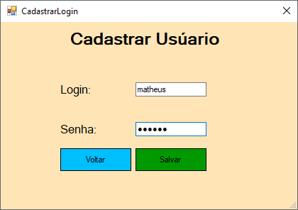
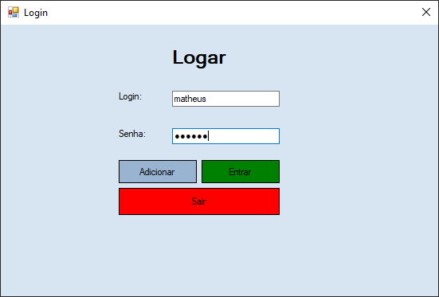
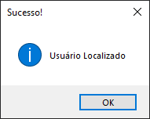
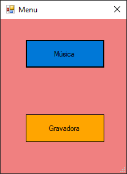
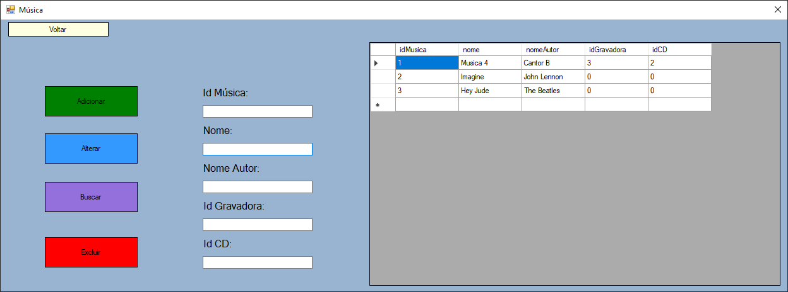
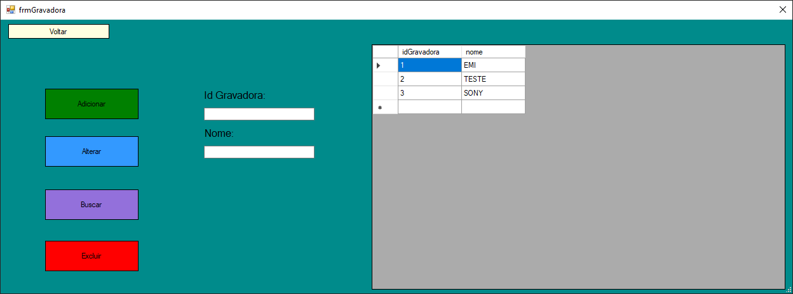

<h1 align="center">2Tri - Trabalho Prático - Modelo MVC - POO</h1> 

Projeto desenvolvido para a disciplica de Programação Orientada e Objeto (POO) em C#, utilizando a arquitetura em camadas e CRUD. Guilherme Henrique (20) e Matheus Eugênio Moreira (38)

<h4 align="left">C#, MySql</h4> 
<h4 align="left">CRUD</h4> 

<h1 align="center">Imagens do projeto</h1> 
 

 
 

 
 
 
  

 
 

 

 
 

 

 
 

 

 
 

